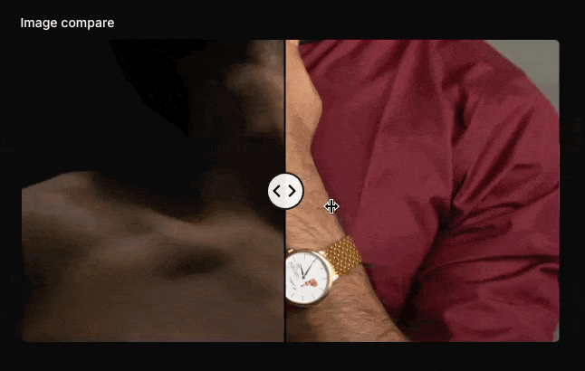

# Filament Favicon

[](https://packagist.org/packages/pxlrbt/filament-image-compare)
[](LICENSE.md)

[](https://packagist.org/packages/pxlrbt/filament-image-compare)

Image Comparison / Two-Up Entry for Before/After Comparison. 



## Installation via Composer

```bash
composer require pxlrbt/filament-image-compare
```

## Usage

```php
ImageCompareEntry::make()
    ->leftImage(fn ($record) => $record->left_image)
    ->rightImage(fn ($record) => $record->right_image)
```

## Contributing

If you want to contribute to this packages, you may want to test it in a real Filament project:

- Fork this repository to your GitHub account.
- Create a Filament app locally.
- Clone your fork in your Filament app's root directory.
- In the `/filament-image-compare` directory, create a branch for your fix, e.g. `fix/error-message`.

Install the packages in your app's `composer.json`:

```json
"require": {
    "pxlrbt/filament-image-compare": "dev-fix/error-message as main-dev",
},
"repositories": [
    {
        "type": "path",
        "url": "filament-image-compare"
    }
]
```

Now, run `composer update`.

## Credits
- [Dennis Koch](https://github.com/pxlrbt)
- [All Contributors](../../contributors)
